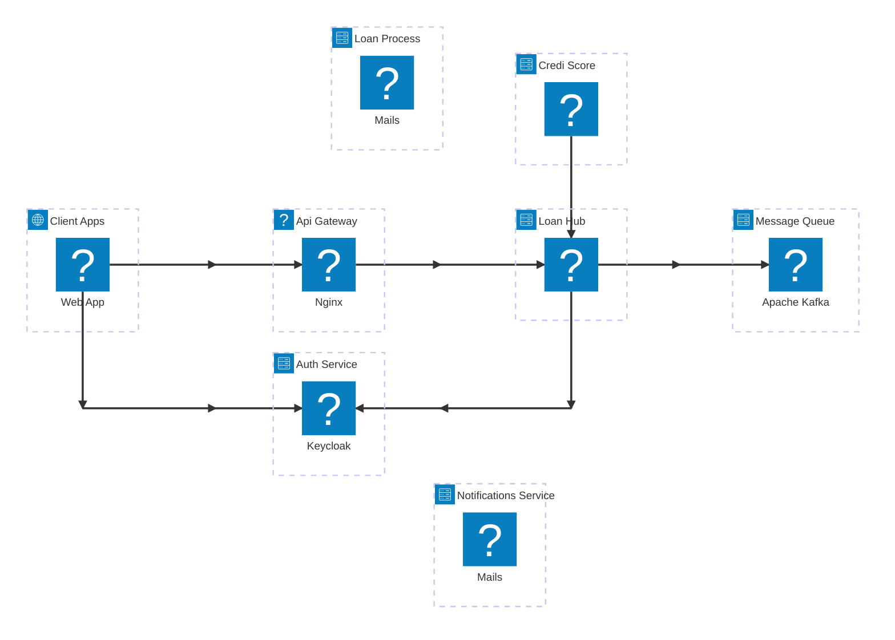

```mermaid
   architecture-beta

   
   %% Junction Definations

   junction web_app_to_nginx_gateway_h1
   junction nginx_gateway_to_loan_hub_server_h1
   junction loan_hub_server_to_apache_kafka_h1

   junction web_app_to_auth_server_h1
   junction web_app_to_auth_server_h2

   junction auth_server_to_loan_hub_server_h1
   junction auth_server_to_loan_hub_server_h2


   %% Group Definations


   group client_apps(internet) [Client Apps]
   service web_app(logos:react)[Web App] in client_apps

   group api_gateway(logos:aws-elb) [Api Gateway]
   service nginx_gateway(logos:nginx)[Nginx] in api_gateway

   group loan_hub(server) [Loan Hub]
   service loan_hub_server(logos:java) in loan_hub
   

   group credi_score(server) [Credi Score]
   service credi_score_server(logos:java) in credi_score

   group messaging_queue(server) [Message Queue]
   service apache_kafka(logos:aws-sns)[ Apache Kafka] in messaging_queue

   group auth_service(server) [ Auth Service]
   service auth_server(logos:aws-iam) [Keycloak] in auth_service

   group notification_service(server) [ Notifications Service]
   service mail_seever(logos:google-gmail) [Mails] in notification_service

   group loan_process_service(server) [ Loan Process]
   service loan_process_server(logos:google-gmail) [Mails] in loan_process_service

   %% Link Definations

   web_app:R --> L:web_app_to_nginx_gateway_h1
   web_app_to_nginx_gateway_h1:R --> L:nginx_gateway
   nginx_gateway:R --> L:nginx_gateway_to_loan_hub_server_h1
   nginx_gateway_to_loan_hub_server_h1:R --> L:loan_hub_server

   loan_hub_server:R --> L:loan_hub_server_to_apache_kafka_h1
   loan_hub_server_to_apache_kafka_h1:R --> L:apache_kafka


   web_app:B --> T:web_app_to_auth_server_h1
   web_app_to_auth_server_h1:R --> L:web_app_to_auth_server_h2
   web_app_to_auth_server_h2:R --> L:auth_server

   auth_server:R <-- L:auth_server_to_loan_hub_server_h1
   auth_server_to_loan_hub_server_h1:R <-- L:auth_server_to_loan_hub_server_h2
   loan_hub_server:B --> T:auth_server_to_loan_hub_server_h2 

   loan_hub_server:T <-- B:credi_score_server

      


        
```