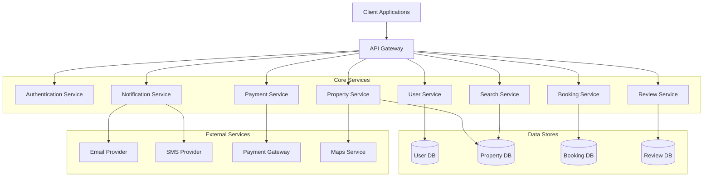
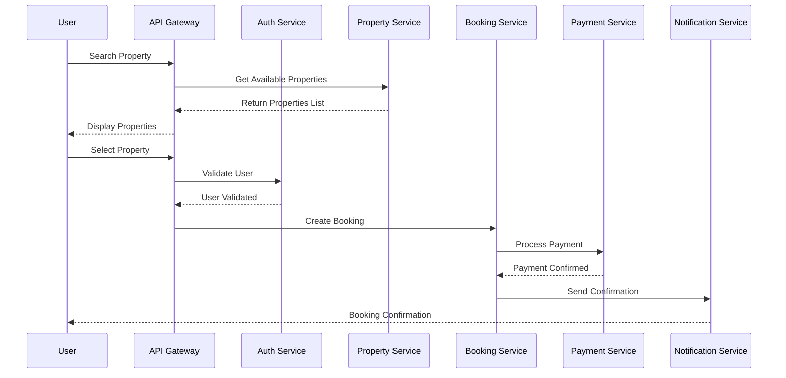
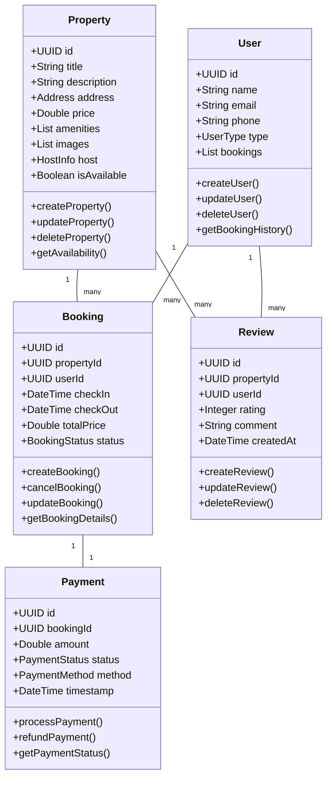
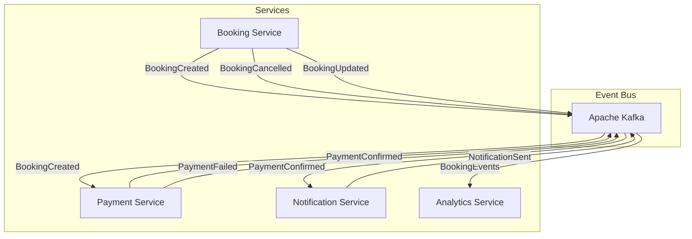

```mermaid
graph TB
    Client[Client Applications]
    Gateway[API Gateway]
    
    subgraph Core Services
        Auth[Authentication Service]
        Property[Property Service]
        Booking[Booking Service]
        Payment[Payment Service]
        User[User Service]
        Search[Search Service]
        Review[Review Service]
        Notification[Notification Service]
    end
    
    subgraph Data Stores
        UserDB[(User DB)]
        PropertyDB[(Property DB)]
        BookingDB[(Booking DB)]
        ReviewDB[(Review DB)]
    end
    
    subgraph External Services
        Email[Email Provider]
        SMS[SMS Provider]
        PaymentGateway[Payment Gateway]
        Maps[Maps Service]
    end

    Client --> Gateway
    Gateway --> Auth
    Gateway --> Property
    Gateway --> Booking
    Gateway --> Payment
    Gateway --> User
    Gateway --> Search
    Gateway --> Review
    Gateway --> Notification
    
    User --> UserDB
    Property --> PropertyDB
    Booking --> BookingDB
    Review --> ReviewDB
    
    Property --> Maps
    Payment --> PaymentGateway
    Notification --> Email
    Notification --> SMS
    Search --> PropertyDB
```

```mermaid
sequenceDiagram
    participant User
    participant Gateway as API Gateway
    participant Auth as Auth Service
    participant Property as Property Service
    participant Booking as Booking Service
    participant Payment as Payment Service
    participant Notification as Notification Service

    User->>Gateway: Search Property
    Gateway->>Property: Get Available Properties
    Property-->>Gateway: Return Properties List
    Gateway-->>User: Display Properties

    User->>Gateway: Select Property
    Gateway->>Auth: Validate User
    Auth-->>Gateway: User Validated
    Gateway->>Booking: Create Booking
    Booking->>Payment: Process Payment
    Payment-->>Booking: Payment Confirmed
    Booking->>Notification: Send Confirmation
    Notification-->>User: Booking Confirmation
```

```mermaid
classDiagram
    class Property {
        +UUID id
        +String title
        +String description
        +Address address
        +Double price
        +List<Amenities> amenities
        +List<Images> images
        +HostInfo host
        +Boolean isAvailable
        +createProperty()
        +updateProperty()
        +deleteProperty()
        +getAvailability()
    }

    class Booking {
        +UUID id
        +UUID propertyId
        +UUID userId
        +DateTime checkIn
        +DateTime checkOut
        +Double totalPrice
        +BookingStatus status
        +createBooking()
        +cancelBooking()
        +updateBooking()
        +getBookingDetails()
    }

    class User {
        +UUID id
        +String name
        +String email
        +String phone
        +UserType type
        +List<Booking> bookings
        +createUser()
        +updateUser()
        +deleteUser()
        +getBookingHistory()
    }

    class Payment {
        +UUID id
        +UUID bookingId
        +Double amount
        +PaymentStatus status
        +PaymentMethod method
        +DateTime timestamp
        +processPayment()
        +refundPayment()
        +getPaymentStatus()
    }

    class Review {
        +UUID id
        +UUID propertyId
        +UUID userId
        +Integer rating
        +String comment
        +DateTime createdAt
        +createReview()
        +updateReview()
        +deleteReview()
    }

    Property "1" -- "many" Booking
    User "1" -- "many" Booking
    Booking "1" -- "1" Payment
    Property "1" -- "many" Review
    User "1" -- "many" Review
```

```mermaid
graph TB
    subgraph Event Bus
        Kafka[Apache Kafka]
    end

    subgraph Services
        Booking[Booking Service]
        Payment[Payment Service]
        Notification[Notification Service]
        Analytics[Analytics Service]
    end

    Booking -->|BookingCreated| Kafka
    Booking -->|BookingCancelled| Kafka
    Booking -->|BookingUpdated| Kafka
    
    Kafka -->|BookingCreated| Payment
    Kafka -->|PaymentConfirmed| Notification
    Kafka -->|BookingEvents| Analytics
    
    Payment -->|PaymentConfirmed| Kafka
    Payment -->|PaymentFailed| Kafka
    
    Notification -->|NotificationSent| Kafka
```